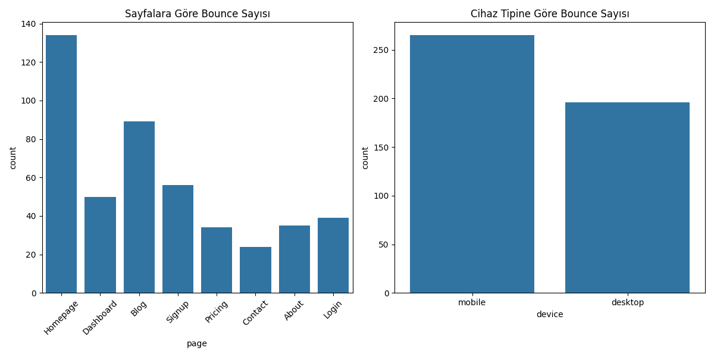
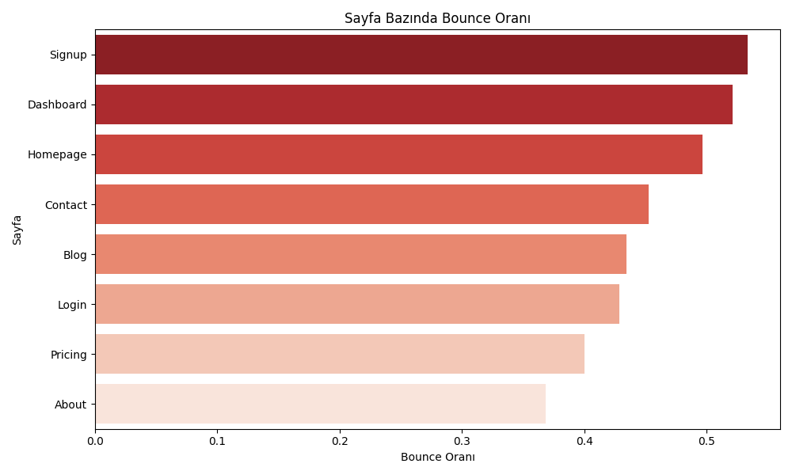
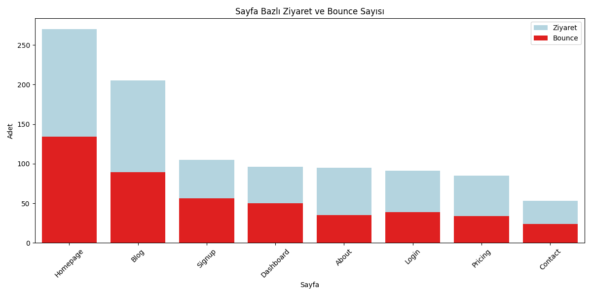
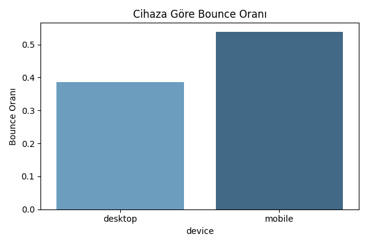
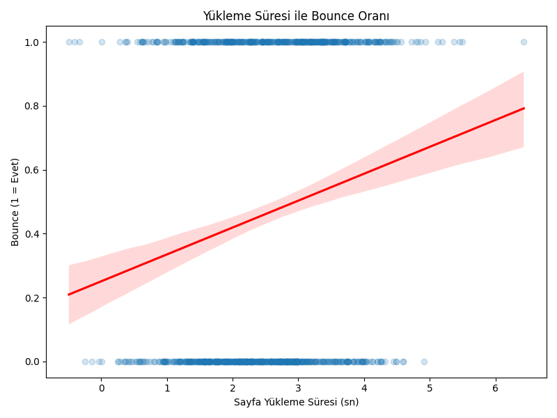
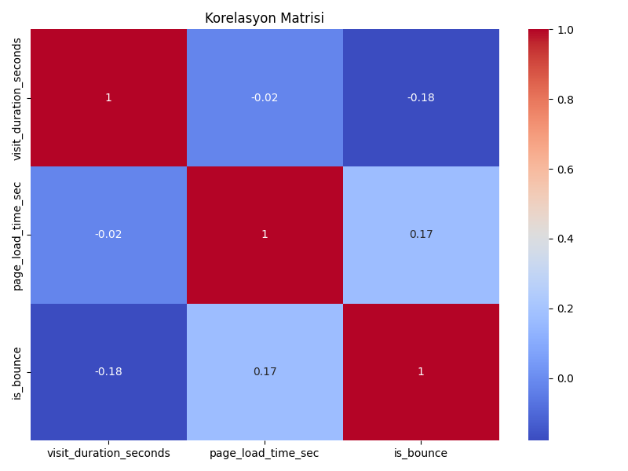

## Proje Adı: Bounce Rate Analizi – Web Sitesinde Ziyaretçilerin Hızla Çıkmasının Nedenleri


"Siteye her gün yüzlerce kişi giriyor ama kimse kayıt olmuyor."
"Pricing sayfasına girenler 10 saniye içinde çıkıyor?"
"Mobil trafiğimiz var ama hemen terk ediyorlar. Neden?"

 Bu sadece yazılımla ilgili bir sorun değil, bir kullanıcı deneyimi problemi. Ziyaretçiler siteden çıkıyor çünkü bir şey onları rahatsız ediyor, engelliyor ya da tatmin etmiyor.


## 📊 Proje Hakkında
Web sitesi ziyaretçi davranışlarını analiz eden ve özellikle bounce (hemen çıkış) oranlarını inceleyen bir veri analizi çalışmasıdır.Web
sitesi yüksek trafik almasına rağmen, kullanıcılar sadece birkaç saniye içinde çıkış yapıyor. Bu analiz, kullanıcıların neden sitede kalmadığını, hangi sayfaların problemli olduğunu ve hangi cihazlarda bu durumun daha sık yaşandığını veriyle açıklamayı hedefliyor.


## 🔍 Özellikler
- Sayfa bazlı bounce oranı analizi
- Cihaz tipine göre bounce analizi
- Kullanıcı tipine (yeni/geri dönen) göre analiz
- Sayfa yüklenme süresi ve bounce ilişkisi
- Detaylı görselleştirmeler ve istatistiksel analizler

## 📁 Proje Yapısı
```
ders1/
│
├── data/                      # Veri dosyaları
│   └── web_data.csv          # İşlenmiş/oluşturulan veri seti
│
├── outputs/                   # Oluşturulan grafikler ve görseller
│   ├── Correlation_Matrix.png
│   ├── load_time_and_bounce_rate.png
│   ├── bounce_rate_by_device.png
│   ├── total_visits_bounce_rate.png
│   └── page_bounce_rate.png
│
├── scripts/                   # Python scriptleri
│   ├── bounce_rate.py
│   ├── create_data.py
│   └── bounce_analiz.py
│
└── readme.md                  # Proje dokümantasyonu
```

## 📊 Veri Seti İçeriği
Veri seti aşağıdaki alanları içermektedir:
- `user_id`: Kullanıcı kimlik numarası
- `page`: Ziyaret edilen sayfa
- `visit_duration_seconds`: Ziyaret süresi
- `device`: Kullanıcı cihaz tipi (desktop/mobile)
- `page_load_time_sec`: Sayfa yüklenme süresi
- `user_type`: Kullanıcı tipi (new/returning)
- `is_bounce`: Hemen çıkış yapılıp yapılmadığı (1/0)

## 📈 Analiz Özellikleri
1. **Genel Bounce Analizi**
   - Toplam ziyaret sayısı
   - Bounce yapan ziyaret sayısı
   - Genel bounce oranı

2. **Sayfa Bazlı Analiz**
   - Her sayfa için bounce sayısı ve oranı
   - Sayfa performans karşılaştırması

3. **Cihaz Analizi**
   - Masaüstü ve mobil cihaz karşılaştırması
   - Cihaz bazlı bounce oranları

4. **Kullanıcı Tipi Analizi**
   - Yeni ve geri dönen kullanıcı davranışları
   - Kullanıcı tipi bazlı bounce oranları

## 📊 Çıktılar
- Detaylı bounce istatistikleri
- Görselleştirmeler ve grafikler
- Sayfa performans raporları
- İstatistiksel test sonuçları

## 📈 İstatistiksel Analizler
- T-testi (Sayfa yüklenme süresi ve bounce ilişkisi)
- Ki-kare testi (Kullanıcı tipi ve bounce ilişkisi)
- Korelasyon analizi




Sayfalara göre en çok bounce edilen ana sayfa (Homepage) olup yaklaşık 135 bounce ile kullanıcıların büyük bir kısmının siteye girer girmez ayrıldığını göstermektedir. Bu durum, ana sayfanın kullanıcıları yeterince yönlendiremediğini ya da ilgilerini çekmediğini düşündürebilir. İkinci sırada yaklaşık 90 bounce ile Blog sayfası yer almakta, bu da içeriklerin yeterince ilgi çekici olmadığını veya kullanıcıların aradıkları bilgileri bulamadıklarını gösterebilir. Signup sayfasında yaklaşık 56 bounce görülmekte, bu da kayıt formunun karmaşık olması, güven sorunları ya da kullanıcı dostu olmaması gibi nedenlere işaret edebilir. Dashboard sayfasında ise yaklaşık 50 bounce bulunmakta, bu sayfa kullanıcıların beklentilerini karşılamıyor veya yeterli yönlendirme sunmuyor olabilir. Login sayfası 39 bounce ile kullanıcıların giriş yaparken sorun yaşayabildiğini ya da işlemi tamamlamadan siteden ayrıldıklarını gösteriyor. About sayfasında 35, Pricing sayfasında ise 34 bounce görülmekte; bu sayfalarda da kullanıcıların yeterli bilgiye ulaşamamış ya da beklentilerini karşılamamış olabilecekleri düşünülüyor. En az bounce edilen sayfa ise Contact olup 23 bounce ile kullanıcıların bu sayfada aradıkları iletişim bilgilerine ulaştıkları anlaşılıyor.

 cihaz türlerine bakıldığında, yaklaşık 265 bounce ile mobil cihazlar, açık ara en çok bounce edilen platform. Bu, mobilde ciddi kullanıcı deneyimi sorunları olduğunu gösteriyor. 195 bounce ile Masaüstü kullanıcılarında bounce oranı daha düşük, bu da desktop deneyiminin daha iyi olduğunu gösteriyor.


----------

## Bounce Rate Analizi

### Genel Bounce Analizi
- Toplam Ziyaret Sayısı:** 1000  
- Bounce Yapan Ziyaret Sayısı:** 461  
- Genel Bounce Oranı:** %46.10


### Sayfalara Göre Detaylı Bounce Analizi

| Sayfa       | Toplam Ziyaret | Bounce Sayısı | Bounce Oranı |
|-------------|----------------|---------------|--------------|
| Homepage    | 270            | 134           | %49.63       |
| About       | 95             | 35            | %36.84       |
| Signup      | 105            | 56            | %53.33       |
| Dashboard   | 96             | 50            | %52.08       |
| Blog        | 205            | 89            | %43.41       |
| Contact     | 53             | 24            | %45.28       |
| Pricing     | 85             | 34            | %40.00       |
| Login       | 91             | 39            | %42.86       |

---

### Cihaz Tipine Göre Detaylı Bounce Analizi

| Cihaz Tipi | Toplam Ziyaret | Bounce Sayısı | Bounce Oranı |
|------------|----------------|---------------|--------------|
| Mobile     | 492            | 265           | %53.86       |
| Desktop    | 508            | 196           | %38.58       |

---

### Kullanıcı Tipine Göre Detaylı Bounce Analizi

| Kullanıcı Tipi | Toplam Ziyaret | Bounce Sayısı | Bounce Oranı |
|----------------|----------------|---------------|--------------|
| New            | 617            | 328           | %53.16       |
| Returning      | 383            | 133           | %34.73       |


Genel olarak, sitenin bounce oranı %46.10 seviyesinde olup kabul edilebilir bir düzeydedir, ancak kullanıcı deneyimini iyileştirmeye yönelik çalışmalarda bulunulabilir. Sayfa bazında baktığımızda, en yüksek bounce oranları Signup (%53.33) ve Dashboard (%52.08) sayfalarında görülmektedir. Bu durum, kullanıcıların kayıt veya kullanım sürecinde zorlandığını ya da aradıklarını hızlıca bulamadıklarını düşündürmektedir. Ana sayfa da %49.63 bounce oranı ile dikkat çekerken, kullanıcıların ilk izlenimde siteyle yeterince etkileşime girmediği izlenimini veriyor. Cihaz bazında yapılan analizde ise mobil kullanıcıların %53.86 gibi oldukça yüksek bir oranla siteyi terk ettiğini görüyoruz. Bu durum, mobil arayüzdeki tasarım ve performans sorunlarına işaret ediyor olabilir. Masaüstü kullanıcıları ise daha düşük bir oranla (%38.58) bounce yaparak daha iyi bir sonuç gösteriyor. Bu fark, mobil optimizasyonun önceliklendirilmesi gerektiğini açıkça ortaya koyuyor. Kullanıcı tipi bazında değerlendirdiğimizde ise yeni kullanıcıların %53.16 gibi yüksek bir oranla bounce yapması, sitenin ilk defa ziyaret edenler için yeterince ikna edici veya yönlendirici olmadığını göstermektedir. Buna karşılık, geri dönen kullanıcılar %34.73 bounce oranı ile daha sadık ve etkileşimde kalma eğilimindedir. Bu durum, kullanıcıların siteye alıştıkça değer bulduklarını, fakat ilk ziyaret deneyimlerinin geliştirilmesi gerektiğini işaret ediyor.


---------


   


Bu grafik, her bir sayfanın bounce oranını (hemen çıkış oranı) göstermektedir. Yani, kullanıcıların o sayfaya girdikten sonra siteyi terk etme olasılıklarını karşılaştırma imkânı sunmaktadır. En yüksek bounce oranı Signup (Kayıt Ol) sayfasında görülmektedir (%53). Bu durum, kullanıcıların kayıt olma adımında siteyi terk etme eğiliminde olduğunu göstermektedir. Bunun nedeni kayıt formunun karmaşık olması, güven vermemesi ya da gereksiz bilgi talep etmesi olabilir.Dashboard ve Homepage sayfalarında da yüksek bounce oranları dikkat çekmektedir. Dashboard sayfasında kullanıcılar aradıkları bilgilere
ulaşamıyor olabilir. Ana sayfada ise içerik yeterince ilgi çekici değil ya da kullanıcıyı yönlendiren net bir yapı eksik olabilir. Contact, Blog ve Login sayfalarında ise bounce oranları orta seviyededir. Özellikle Contact sayfasında, kullanıcıların iletişim bilgisine ulaşmadan çıkış yapmaları olası bir sorun olarak değerlendirilebilir.

En düşük bounce oranı About ve Pricing sayfalarında gözlemlenmektedir. Bu durum, kullanıcıların bu sayfalarda daha fazla vakit geçirdiğini veya başka sayfalara yönelmeye daha meyilli olduğunu gösterebilir. Kritik problemli sayfalar arasında Signup, Dashboard ve Homepage yer almaktadır. Bu sayfalarda kullanıcı deneyimi, içerik kalitesi veya teknik problemler gibi konularda iyileştirme ihtiyacı olabilir.


,
Sayfa bazlı ziyaret ve bounce sayılarına bakıldığında, Homepage en çok ziyaret edilen ve aynı zamanda en fazla bounce edilen sayfa konumundadır. Yaklaşık 270 ziyaretin 140'ı bounce ile sonuçlanmış ve bu da %49,63'lük bir bounce oranına işaret etmektedir. Bu durum, ana sayfanın ilk izlenim açısından yeterince etkili olmadığını ve kullanıcıları sitede tutmakta zorlandığını göstermektedir.

Dashboard sayfası da benzer şekilde yüksek bir bounce oranına sahiptir (%52,08). Bu, kullanıcıların bu sayfaya geldikten sonra ne yapmaları gerektiği konusunda yeterli yönlendirme almadıklarını ve sayfada değerli içerik bulamadıklarını düşündürebilir. Signup (Kayıt Ol) sayfasında da yüksek bir bounce oranı (%53,33) dikkat çekmektedir. Bu, kayıt formunun karmaşıklığı, güven eksikliği ya da gereksiz bilgi talepleri gibi nedenlerle kullanıcıların süreci tamamlamadan siteyi terk ettiğini gösteriyor. Buna karşılık, Contact, About ve Pricing gibi daha çok bilgi sunmaya yönelik sayfalarda bounce oranları nispeten daha düşüktür. Bu sayfalarda kullanıcılar aradıkları bilgiye ulaşıyor olabilir, bu da sayfaların işlevini yerine getirdiğini göstermektedir. Login sayfasının bounce oranı (%42,86) diğer sayfalara kıyasla daha düşüktür. Ancak bu oranın yorumlanması daha farklıdır; kullanıcıların giriş yapmadan ayrılması, teknik bir sorun ya da hatırlanmayan şifre gibi nedenlerden kaynaklanıyor olabilir.



Cihaza göre bounce oranları incelendiğinde, mobil cihazlardan gelen kullanıcıların bounce oranı %58 gibi oldukça yüksek bir seviyededir. Bu oran, kullanıcıların mobilde siteye girdikten sonra büyük bir kısmının hızlıca ayrıldığını ve mobil deneyimin ciddi sorunlar barındırdığını göstermektedir. Öte yandan, desktop kullanıcılarında bounce oranı %37 civarında seyretmekte olup, bu desktop kullanıcılarına göre makul bir değerdir ve masaüstü deneyimin daha etkileşimli ve kullanıcıya yönelik olduğunu bize göstermektedir.

Mobildeki bu yüksek bounce oranının altında yatan muhtemel nedenler arasında responsive tasarım eksikliği, sayfa öğelerinin ekrana tam oturmaması veya kayma yapması yer alabilir. Ayrıca, yavaş yükleme süreleri, mobil kullanıcıların sabırsız davranmasına yol açarak terk oranını artırabilir. CTA (Call to Action) butonlarının küçük, zor erişilebilir ya da görünmez olması da kullanıcıyı yönlendirmekte yetersiz kalabilir. Aynı şekilde, form alanlarının mobil uyumluluğunun zayıf olması, yani tıklanabilir alanların küçük, klavye uyumunun kötü ya da bilgi girişinin zahmetli olması, kullanıcıların sayfayı hızlıca terk etmesine neden olabilir.




 sayfa yüklenme süresi ile kullanıcıların sayfadan hemen çıkma olasılığı arasındaki ilişki görmekteyiz. X ekseni sayfa yüklenme süresini saniye cinsinden, Y ekseni ise bounce durumunu (1 = hemen çıkış, 0 = çıkış yapılmadı) temsil ediyor. Kırmızı çizgi, yüklenme süresi arttıkça bounce olasılığının nasıl değiştiğini gösteren regresyon eğrisidir; etrafındaki kırmızı alan ise bu tahminde bulunan belirsizliği, yani güven aralığını ifade eder. Grafik, sayfa yüklenme süresi ile bounce oranı arasında pozitif bir ilişki olduğunu ortaya koymaktadır. Özellikle yüklenme süresi 2-3 saniyeyi aştığında bounce oranında ciddi bir artış gözlemlenmektedir. 0-1 saniye aralığında bounce oranı yaklaşık %20 iken, bu oran 5-6 saniyeye ulaşıldığında %80'e kadar çıkabilmektedir. Mavi noktalar, her bir ziyaretin bounce olup olmadığını gösteren veri noktalarıdır ve bu noktaların üstte ya da altta yoğunlaştığı gözlemlenmektedir. Bu da yüklenme süresi kısa olan sayfalarda da bounce yaşanabileceğini, ancak yüklenme süresi uzadıkça bu oranın belirgin şekilde arttığını göstermektedir. Bu bulgular, kullanıcı deneyimi açısından sayfa yüklenme süresinin ne kadar kritik olduğunu ortaya koymaktadır. Kullanıcılar yavaş yüklenen sayfalarda beklemek istememekte ve sayfayı terk etme eğilimi göstermektedir. 




Bu korelasyon matrisi ziyaret süresi(visit_duration_seconds),sayfa yüklenme süresi(page_load_time_sec), hemen çıkış(is_bounce) değişkenlerinin arasındaki doğrusal ilişkiyi gösteriyor.

visit_duration_seconds & is_bounce:
Korelasyon: -0.18
Negatif ve zayıf bir ilişki var. Yani, ziyaret süresi arttıkça bounce olasılığı azalıyor. Bu beklenen bir sonuç; sayfada daha uzun kalan kullanıcıların hemen çıkma ihtimali daha düşük.

page_load_time_sec & is_bounce:
Korelasyon: 0.17
Pozitif ve zayıf bir ilişki var. Sayfa yüklenme süresi arttıkça bounce olasılığı da artıyor. Yani, yavaş açılan sayfalar kullanıcıyı kaçırıyor.

visit_duration_seconds & page_load_time_sec:
Korelasyon: -0.02
Neredeyse sıfır; aralarında anlamlı bir ilişki yok. Yani, sayfa yüklenme süresi ile ziyaret süresi arasında doğrudan bir bağlantı gözlenmemiş.

Korelasyonlar düşük seviyede, yani değişkenler arasında çok güçlü doğrusal ilişkiler yok. Ancak, is_bounce ile diğer iki değişken arasında beklenen yönlerde (biri negatif, biri pozitif) anlamlı zayıf ilişkiler var. Bu bulgular, bounce oranını azaltmak için ziyaret süresini artırmanın ve yüklenme süresini azaltmanın önemli olduğunu gösteriyor.Sayfa yüklenme süresinin bounce ile pozitif ilişkisi, frontend ve backend optimizasyonlarının kullanıcı tutma açısından kritik olduğunu gösteriyor.


## 📁📊📈  Sonuç:

Ziyaretçilerin Hızla Çıkmasının Temel Nedenleri:

Yavaş Sayfa Yüklenme Süresi:Özellikle yüklenme süresi 2-3 saniyeyi aştığında, kullanıcıların büyük kısmı siteyi terk ediyor. Yavaş açılan sayfalar, sabırsız kullanıcıları kaybetmenin en önemli nedeni. 
Mobil Deneyim Sorunları:mobilde responsive tasarım eksikliği, yavaş yükleme, küçük veya erişilmesi zor butonlar ve form alanlarının mobil uyumsuzluğu gibi sorunların kullanıcıyı siteden uzaklaştırdığını gösteriyor.

Kritik Sayfalarda Kötü Kullanıcı Deneyimi:Kayıt formunun karmaşıklığı, güven eksikliği, gereksiz bilgi talepleri, ana sayfanın ilgi çekici olmaması ve Dashboard'da yeterli yönlendirme/katma değer sunulmaması, kullanıcıların siteyi terk etmesine yol açıyor.

Ziyaret Süresinin Kısalığı:kullanıcıyı sitede tutacak içerik ve etkileşim eksikliği de önemli bir problem.

bunlara ek olarak başka nedenler de olabilir.Açılır Pencereler ve Rahatsız Edici Reklamlar,Dil ve İçerik Uyumsuzluğu,Teknik Hatalar ve Bozuk Linkler,Aşırı Kayıt veya Bilgi Talebi,Kötü Görsel ve Tasarım Kalitesi gibi nedenler kullanıcının siteyi terketmesine yol açıyor olabilir.

## Ne Yapılabilir? (Çözüm ve İyileştirme Önerileri):

Bounce oranlarını düşürmek ve kullanıcı deneyimini iyileştirmek için teknik ve tasarımsal birçok iyileştirme yapılmalıdır. Öncelikle sayfa yüklenme süreleri 2 saniyenin altına çekilmeli; görsel ve script optimizasyonları yapılmalı, gereksiz dosya ve kodlar kaldırılmalı, sunucu yanıt süreleri iyileştirilmeli ve CDN kullanımı gibi teknikler uygulanmalıdır. Mobil kullanıcılar özelinde ise sitenin tam anlamıyla responsive olması sağlanmalı, form ve butonlar mobilde kolay erişilebilir hale getirilmelidir. Özellikle signup sayfası sadeleştirilmeli, kullanıcıya neden bilgi istendiği açıkça belirtilmeli ve gizlilik garantisi gibi güven veren unsurlar eklenmelidir. Ana sayfada güçlü ve net bir çağrı (CTA) yer almalı, etkileyici içerik ile ilk izlenim kuvvetlendirilmelidir. Dashboard gibi iç sayfalarda ise kullanıcılara ihtiyaç duydukları değerli içerik sunulup sunulmadığı değerlendirilmeli, onboarding süreci iyileştirilmelidir. Kullanıcının sitede aradığı bilgiye kolayca ulaşması sağlanmalı, etkileşimli ve ilgi çekici içerikler eklenmelidir. Ayrıca tüm bu süreçler düzenli olarak izlenmeli; sayfa hızları, bounce oranları ve kullanıcı davranışları takip edilmeli, A/B testleri ile farklı tasarım ve içeriklerin etkisi ölçülmeli ve kullanıcı geri bildirimleri dikkate alınarak sürekli iyileştirme sağlanmalıdır. Özellikle mobil deneyimin önceliklendirilmesi, kapsamlı kullanıcı testleri ile sorunlu noktaların tespiti ve mobilde erişilebilirliğin artırılması, genel kullanıcı memnuniyeti açısından kritik öneme sahiptir.


## 🔧 Gereksinimler
- Python 3.x
- pandas
- numpy
- matplotlib
- seaborn
- scipy

## 📝 Kurulum
1. Projeyi klonlayın
```bash
git clone [(https://github.com/guleralp/Bounce-Rate-Analizi.git)]
```

2. Gerekli paketleri yükleyin
```bash
pip install pandas numpy matplotlib seaborn scipy
```

3. Scriptleri çalıştırın
```bash
python scripts/bounce_analiz.py
```

## 📊 Örnek Görselleştirmeler
- Sayfa bazlı bounce oranları grafiği
- Cihaz tipine göre bounce dağılımı
- Sayfa yüklenme süresi ve bounce ilişkisi grafiği
- Korelasyon matrisi


## 📄 Lisans
Bu proje MIT lisansı altında lisanslanmıştır.

